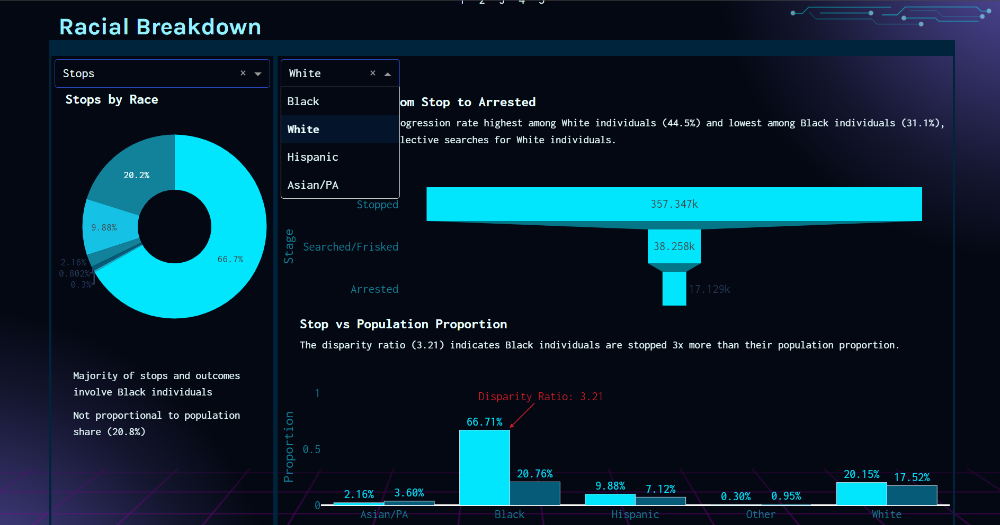

# Policing the Police

Analyzing racial disparities in Philadelphia traffic policing.

## Project Overview

The goal of this project is to investigate potential racial biases in Philadelphia's traffic stop data and explore their implications. By analyzing traffic stop data and comparing it with population demographics, the project seeks to uncover trends and disparities that may point to racial biases in policing practices.

## Example Screenshots

### Page 1

- This page gives us some high-level insights. On the top we can see the total stops, searches, arrests and the hit rate (percentage of successful searches. A search is considered successful when it leads to contraband being found).
- On the bottom left is a line graph showing the number of traffic stops at different times of the day. We assume here that night time is from 6:00 PM to 5:59 AM, and daytime is from 6:00 AM to 5:59 PM.
- On the bottom right is a geospatial map of the most active areas for traffic stops. It is not surprising to note that the brightest areas are neighborhoods where 50-75% of the population is either Black or Hispanic.
  

### Page 2

This page highlights the results of the outcome test over the years with an animated bar chart. Overtime, the bars start to even out. However, between 2014 and 2015, disparities existed in how often Black individuals were wrongfully searched.

There is also the stop progression by race over the years. The spikes in arrests and frisks can be seen again in 2014, specifically for Black drivers. Two significant events occured during those years that could explain these shifts.

- In 2014, an 18-year old named Michael Brown was shot by a police officer during an altercation through the police vehicle's window. This caused a rise in the Black Lives Matter movements, and increased scrutiny on police practices.
- In 2015, a 25-year-old African American was arrested for the posession of a knife. While in police custody, he sustained fatal injuries to his cervical spinal cord and died. There was an uproar of nationwide protests and six Baltimore police officers were suspended after an investigation.
  

### Page 3

On the last page, we take a closer look at the overall racial disparities in policing. The funnel chart shows us hwo traffic stops evolve into more serious actions. Although based on the donut chart, stops and searches are highest among Black drivers, the conversion rate from being searched/frisked to arrest is highest among White drivers, 44.5%, then Hispanic at 37.1%, and finally Black at 31.1%. This implies that police are making more informed search decisions on White drivers, and searching the minority races on the basis of less evidence.

The donut chart shows us the percentage of stops, search, and arrests by race. The population disparity chart shows us that there is almost an equal percentage of Black and White residents in Philadelphia. However, the disparity ratio suggests that Black individuals are stopped over 3 times more than their population share.


## Data Sources

- **Traffic Stop Data**: The dataset for traffic stops was sourced from the [Stanford Open Policing Project](https://openpolicing.stanford.edu/data/).
- **Population Demographics Data**: This dataset has population counts for each race and was sourced from the [U.S. Census Bureau](https://www.census.gov/data.html).

## Tools and Technologies

- **Data Analysis**: The data was cleaned and analyzed using the Python library Pandas.
- **Visualization**: All the interactive plots and visualizations were created using Plotly.
- **Dashboard**: The dashboard displaying insights from the analysis was built using DASH, a web-based Python framework for creating interactive web applications.

## How to Run

1. Clone the repository and navigate to the project directory.
2. Install the required dependencies

```bash
pip install -r requirements.txt
```

3. Run the DASH app

```bash
python index.py
```

4. Open your browser and go to `http://localhost:8050` to view the dashboard.

### _Important Note on Reproducing the Dash App_

Due to GitHub's restriction on uploading large data files directly to the repository, the data is currently being loaded through URLs into Pandas dataframes. However, this approach can cause the application to take at least 10 minutes to render.

To improve performance, it is recommended to manually download the datasets using the URLs provided in `index.py` and place them into a local `data` folder. Detailed instructions for doing this can be found in `index.py` on lines 34-46.
